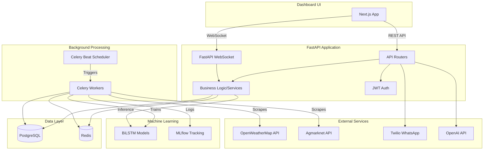
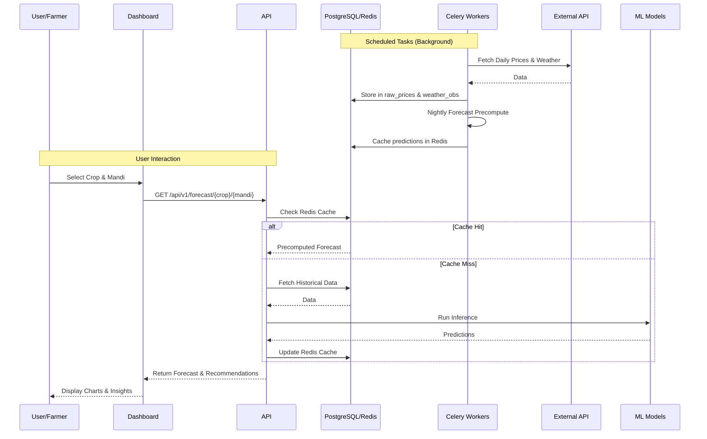
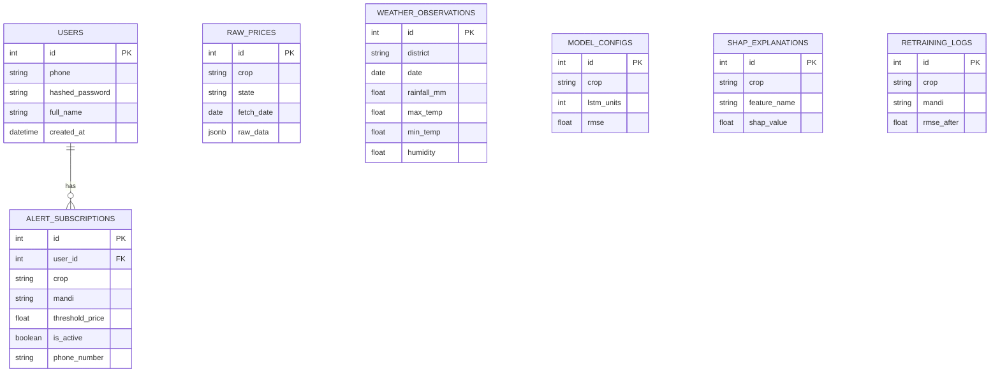
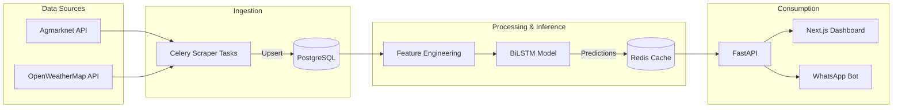

# AgriPrice Sentinel - Complete Technical Project Documentation

## 1. Project Overview
**What the project does:** AgriPrice Sentinel is a crop price forecasting and alerting system tailored for Indian mandi (agricultural) markets. It provides multi-step future price predictions (30, 60, and 90 days out) for 16 major crops across 28 states, offering actionable SELL/HOLD recommendations to farmers based on Government Minimum Support Prices (MSP).

**Why it exists:** The agricultural market is highly volatile and influenced by numerous factors like weather, seasonal cycles, and market arrivals. Farmers often lack data-driven insights into future price trends, leading to sub-optimal selling decisions. AgriPrice Sentinel bridges this gap by leveraging machine learning to empower farmers with actionable intelligence.

## 2. Complete Technology Stack
- **Frontend:** Next.js (React), Tailwind CSS, shadcn/ui, Recharts, React Query, Axios.
- **Backend:** FastAPI (Python), SQLAlchemy 2.0 (Async), Uvicorn, Celery, Pydantic, Passlib (bcrypt), JWT.
- **Machine Learning:** TensorFlow/Keras (BiLSTM with Bahdanau Attention & MC Dropout), Scikit-Learn, Keras Tuner, SHAP (Integrated Gradients), PyTorch Forecasting (TFT as challenger), XGBoost (baseline), MLflow.
- **Database:** PostgreSQL (Primary Data Store), Redis (Celery Broker & Caching).
- **External Integrations:** OpenWeatherMap API, Agmarknet (data.gov.in) API, Twilio (WhatsApp Bot & Alerts), OpenAI API (Fallback NLP for Bot).
- **Infrastructure:** Docker, Docker Compose, Nginx, Prometheus, Grafana, Alertmanager, PgBouncer.

## 3. Project Architecture

## 4. Application Workflow

## 5. How the Frontend Works
The frontend is a **Next.js** application providing an interactive dashboard.
- **Routing:** Uses Next.js App Router structure.
- **State Management & Fetching:** Uses `React Query` for data fetching, caching, and synchronization with the backend API.
- **Real-time Updates:** Implements custom hooks (`useWebSocket.ts`) to listen to WebSocket channels for live price updates.
- **Styling:** Uses Tailwind CSS and `shadcn/ui` components for a modern, responsive design.
- **Visualization:** Utilizes `Recharts` for plotting forecast trends, confidence intervals, and SHAP feature importance charts.
- **Offline/Demo Mode:** Contains fallback generators to simulate data when the backend is offline.

## 6. How the Backend Works
The backend is built with **FastAPI**, emphasizing high performance and asynchronous operations.
- **Architecture Pattern:** Follows Clean Architecture principles using a Service-Repository pattern (e.g., `ForecastService`, `ForecastRepository`).
- **API Layer:** Organized into modular routers (`routes_forecast.py`, `routes_prices.py`, `routes_alerts.py`, etc.).
- **Background Tasks:** Offloads heavy operations (scraping, model retraining, batch pre-computation, alert dispatching) to **Celery** workers.
- **Caching:** Uses Redis to cache expensive ML inference results (`ForecastService`).

## 7. How Frontend and Backend Communicate
Communication occurs via two primary channels:
1. **RESTful APIs:** The frontend uses `Axios` to make HTTP GET/POST requests for standard operations (auth, fetching history, requesting forecasts).
2. **WebSockets:** The frontend connects to `ws://.../ws/prices/{crop}/{mandi}` to receive real-time price updates pushed by the backend.

## 8. Database Architecture (ER Diagram)

## 9. API Documentation
Key endpoints (mounted under `/api/v1`):
- **Auth:**
  - `POST /auth/register`: Register a new farmer account.
  - `POST /auth/login`: Authenticate and receive a JWT token.
- **Forecast & Prices:**
  - `GET /forecast/{crop}/{mandi}`: Get multi-step crop price forecasts with 95% CI.
  - `GET /prices/{crop}/{mandi}`: Retrieve historical prices for a crop at a specific mandi.
- **Alerts:**
  - `POST /alerts/subscribe`: Subscribe to price alerts (threshold based).
  - `GET /alerts/active`: Get active subscriptions for the authenticated user.
- **SHAP (Explainability):**
  - `GET /shap/{crop}`: Retrieve feature importance values for a crop.
- **WhatsApp Bot:**
  - `POST /whatsapp/webhook`: Twilio webhook receiver for the interactive bot.
- **WebSockets:**
  - `WS /ws/prices/{crop}/{mandi}`: Live price stream.

## 10. Authentication and Authorization
- **Mechanism:** Stateless JSON Web Tokens (JWT).
- **Implementation:** Uses `passlib(bcrypt)` for password hashing and `python-jose` for JWT generation/verification.
- **Flow:** User logs in with phone/password -> Receives `access_token` -> Includes token in the `Authorization: Bearer <token>` header for protected endpoints (like creating alerts).
- **Dependencies:** `get_current_user` dependency in FastAPI ensures routes are protected.

## 11. Features
1. **Multi-Horizon Forecasting:** Predicts prices for 30, 60, and 90 days.
2. **Uncertainty Estimation:** Uses Monte Carlo Dropout to generate 95% confidence intervals (lower/upper bounds).
3. **Actionable Recommendations:** Compares predictions against MSP to suggest SELL or HOLD.
4. **Real-time Updates:** WebSocket streams for live market changes.
5. **Explainability (XAI):** Integrated Gradients/SHAP values explain *why* a price is predicted, using farmer-friendly labels.
6. **WhatsApp Bot Interface:** Allows farmers to query prices and forecasts via WhatsApp.
7. **Automated Alerting:** Background jobs send SMS/WhatsApp alerts when prices cross thresholds.
8. **Automated Retraining:** Celery beat schedules weekly model retraining and handles cross-crop transfer learning for data-poor crops.
9. **Drift Detection:** EvidentlyAI monitors data drift and triggers retraining if data distributions shift.

## 12. Data Flow

## 13. Configuration
- **Backend:** Managed via `pydantic-settings` (`app/config.py`). Reads from `.env`. Key variables include `DATABASE_URL`, `REDIS_URL`, `SECRET_KEY`, `TWILIO_AUTH_TOKEN`, `DATAGOV_API_KEY`, `OPENWEATHER_API_KEY`, and `OPENAI_API_KEY`.
- **Frontend:** API and WS URLs are configurable via `NEXT_PUBLIC_API_URL` and `NEXT_PUBLIC_WS_URL`.

## 14. Dependencies
- **Backend Core:** `fastapi`, `uvicorn`, `sqlalchemy[asyncio]`, `asyncpg`, `celery`, `redis`, `pydantic`, `pydantic-settings`.
- **ML/Data:** `pandas`, `numpy`, `tensorflow`, `keras-tuner`, `scikit-learn`, `statsmodels`, `prophet`, `xgboost`, `mlflow`, `evidently`.
- **External/Auth:** `aiohttp`, `twilio`, `openai`, `passlib`, `python-jose`.
- **Frontend:** `next`, `react`, `react-query`, `recharts`, `tailwindcss`, `shadcn/ui`, `lucide-react`, `axios`.

## 15. Error Handling
- **API Layer:** Standard HTTP exceptions using `fastapi.HTTPException`. Custom error handlers exist.
- **Scrapers:** Uses `tenacity` for exponential backoff retries on network failures. Scrape failures are logged to a `scrape_errors` database table.
- **Models:** Fallback to baseline (ARIMA/Synthetic data) if deep learning inference fails.
- **Frontend:** Handles API timeouts by seamlessly falling back to a `demo-mode` with synthetic data generation (`generateDemoForecast`, etc.).

## 16. Security
- **Data:** Passwords are never stored in plaintext (bcrypt).
- **Transport:** JWT is used for session management.
- **Environment:** Secrets are loaded from `.env` and never hardcoded.
- **Infrastructure:** Rate limiting and SSL termination via Nginx. Database access is connection-pooled via PgBouncer.

## 17. Testing
- **Unit Tests:** Located in the `tests/` directory (e.g., `test_jwt_secret_validation.py`, `test_forecast_service.py`).
- **Model Evaluation:** A comprehensive evaluation script (`app/model_evaluation.py`) compares ARIMA, SARIMA, Prophet, Vanilla LSTM, BiLSTM+Attention, and TFT across 720 experiment runs.
- **Baseline Comparison:** `scripts/baseline_xgboost.py` provides a fast tree-based baseline for benchmarking.

## 18. Deployment
- **Containerization:** The entire stack (PostgreSQL, Redis, API, Celery Worker, Celery Beat, Frontend, Nginx, Prometheus, Grafana, PgBouncer, MLflow) is orchestrated using `docker-compose.yml`.
- **Orchestration:** Kubernetes manifests (`infra/k8s/api.yaml`) are provided for clustered deployments.
- **Launch Script:** A unified `start_all.bat` script is available for local Windows environments.

## 19. Performance
- **Database:** Uses asynchronous SQLAlchemy with `asyncpg` and PgBouncer for high throughput connection pooling.
- **Caching:** Redis drastically reduces response times for popular crop forecasts (from seconds of inference time to milliseconds).
- **ML Precomputation:** Nightly Celery batch jobs pre-compute and cache forecasts to ensure instant API responses during peak hours.
- **Feature Engineering:** Downsampling algorithms (LTTB) are used to efficiently render large price histories.

## 20. Current Status
The project is structurally complete and fully functional. 
- The backend features robust async APIs, caching, model retraining pipelines, and external integrations.
- The machine learning pipeline includes hyperparameter tuning, transfer learning, Monte Carlo Dropout, and SHAP explainability.
- The frontend is complete with interactive charts, demo fallback modes, and WebSocket integration.
- The infrastructure layer is fully defined with Docker Compose and monitoring tools.

## 21. Code Quality
- **Modularity:** High. Clear separation of concerns (Routers -> Services -> Repositories).
- **Typing:** Extensive use of Python type hints (`from __future__ import annotations`).
- **Logging:** Centralized structured logging replaces ad-hoc print statements.
- **Documentation:** Extensive docstrings and comments in major scripts.

## 22. Future Scope
1. **Multilingual Support:** Localizing the dashboard and WhatsApp bot into regional Indian languages (Hindi, Marathi, Punjabi, etc.).
2. **Satellite Imagery:** Integrating NDVI data for yield predictions to augment the price forecasting model.
3. **Advanced Models:** Fully integrating Temporal Fusion Transformers (TFT) into the production pipeline.
4. **Mobile App:** Creating a dedicated React Native mobile app for better farmer outreach.

## 23. Viva Q&A Preparation

**Q: Why use BiLSTM with Attention instead of XGBoost or ARIMA?**
**A:** While XGBoost is faster, crop prices are sequential time-series data with complex, long-term temporal dependencies and seasonal patterns. BiLSTM captures context from both past and future directions within a sequence, and the Bahdanau Attention mechanism allows the model to focus on specific critical days (e.g., a sudden drought or MSP announcement) when making predictions. We use ARIMA as a baseline, but the deep learning model handles multi-variate inputs (weather, freight) better.

**Q: How do you handle uncertainty in predictions?**
**A:** We use Monte Carlo (MC) Dropout during inference. Instead of making a single prediction, we run the data through the model multiple times with dropout enabled. This produces a distribution of predictions, from which we calculate the mean (predicted price) and standard deviation (to construct the 95% confidence bounds).

**Q: What happens if a crop doesn't have enough historical data?**
**A:** We implement Transfer Learning. We pre-train a shared encoder on high-data crops (like Wheat and Rice) and freeze those base layers. When training for a low-data crop (like Ragi), we only fine-tune the top layers, allowing the model to leverage general market patterns learned from other crops.

**Q: How does the system explain its predictions to a farmer?**
**A:** We use SHAP (SHapley Additive exPlanations) via an Integrated Gradients approach. This calculates the exact contribution of every feature (like yesterday's rainfall or current transport costs) to the final price. We then map these technical feature names to "farmer-friendly labels" and present them visually as bar or waterfall charts on the dashboard.

**Q: How is real-time performance achieved given slow ML models?**
**A:** We use a two-pronged approach: 1) A nightly Celery batch job pre-computes forecasts for all major crop-mandi pairs and caches them in Redis. 2) The API checks Redis first; if there's a cache hit, response time is ~5ms instead of running expensive TensorFlow inference on the fly.
