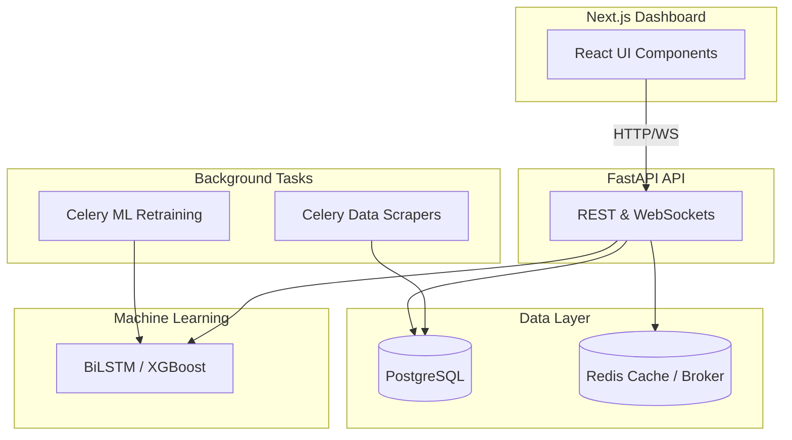

# AgriPrice Sentinel

AgriPrice Sentinel is a robust crop price forecasting and alerting system tailored for Indian mandi (agricultural) markets. It provides multi-step future price predictions for major crops across multiple states, offering actionable intelligence to agricultural stakeholders.

## Problem Statement
The agricultural market in India is highly volatile and influenced by numerous compounding factors like weather patterns, seasonal cycles, and market arrivals. Farmers often lack data-driven insights into future price trends, which forces them to make sub-optimal selling decisions. 

## Solution
AgriPrice Sentinel bridges this gap by leveraging machine learning to empower farmers with actionable intelligence. It automatically scrapes daily mandi prices and weather data, models complex temporal market dependencies, and delivers highly accessible forecasts (including confidence intervals) alongside threshold-based WhatsApp alerts.

## Key Features
- **Multi-Horizon Forecasting:** Predicts crop prices at 30, 60, and 90-day intervals.
- **Uncertainty Estimation:** Generates 95% confidence intervals utilizing Monte Carlo Dropout techniques.
- **Explainable AI (XAI):** Integrated Gradients via SHAP explain the exact feature contributions to predicted prices.
- **Automated Alerting:** Background tasks actively monitor price drifts and dispatch real-time WhatsApp/SMS notifications.
- **Interactive Dashboard:** Modern web interface with real-time price updates streamed over WebSockets.

## System Architecture



## ML / Forecasting

The primary forecasting engine relies on a **BiLSTM (Bidirectional Long Short-Term Memory) network with Bahdanau Attention**, augmented by an **XGBoost** tree-based baseline.

- **Horizons:** 30-day, 60-day, and 90-day forward predictions.
- **Features:** Historical price lags, rolling volatility metrics, seasonal sine/cosine encodings, spatial entity relations, and scraped weather data.
- **Preprocessing:** Outliers are winsorized, and data is standardized using a robust preprocessor before inference.
- **Leakage Prevention:** Strict temporal validation splits ensure that no future validation or test statistics are used during feature scaling or target generation. 
- **Evaluation:** Models are rigorously benchmarked on MAE, RMSE, sMAPE, WAPE, and Directional Accuracy.

## Tech Stack

- **Frontend:** Next.js (React), Tailwind CSS, shadcn/ui, Recharts
- **Backend:** FastAPI (Python), SQLAlchemy (Async), Celery, Pydantic, Passlib, JWT
- **Machine Learning:** TensorFlow/Keras, XGBoost, Scikit-Learn, SHAP
- **Database:** PostgreSQL (Primary), Redis (Cache & Broker)
- **Infrastructure:** Docker Compose, Nginx, Prometheus, Grafana, PgBouncer

## Project Structure

```text
├── app/                  # FastAPI backend application
│   ├── api/              # API routers and endpoints
│   ├── ml/               # Machine learning models and metrics
│   └── tasks/            # Celery background tasks
├── dashboard/            # Next.js frontend application
│   ├── src/app/          # Next.js app router pages
│   └── src/components/   # React components
├── data/                 # Raw/Processed data and model configs (excluded from Git)
├── infra/                # Docker, Kubernetes, and Alembic configuration
├── scripts/              # ML training, evaluation, and pipeline scripts
└── tests/                # Pytest unit and integration tests
```

## Setup

### Prerequisites
- Python 3.10+
- Node.js 18+
- Docker and docker-compose

### Backend Setup
1. Copy `.env.example` to `.env` and provide the required secrets.
```bash
cp .env.example .env
```
2. Set up the virtual environment and install dependencies:
```bash
python -m venv venv
source venv/bin/activate  # On Windows: venv\Scripts\activate
pip install -r requirements.txt
```

### Frontend Setup
1. Navigate to the dashboard directory:
```bash
cd dashboard
npm install
```

## Environment Variables
The application relies on environment variables for sensitive configurations. **Never commit actual credentials.** Refer to the `.env.example` file for the required variable names. You must provide a valid `SECRET_KEY` (minimum 32 characters) for JWT authentication.

## Running the Application

For a complete local launch of the entire stack (Postgres, Redis, API, and Dashboard), you can use Docker Compose:
```bash
docker-compose -f infra/docker-compose.yml up -d
```

Alternatively, to run services individually:
- **Backend API:** `uvicorn app.app:app --host 0.0.0.0 --port 8000`
- **Celery Worker:** `celery -A app.celery_app worker --concurrency=2`
- **Frontend Dashboard:** `cd dashboard && npm run dev`

## API

The application exposes a fully documented OpenAPI specification at `/docs`. 
Key endpoints include:
- `POST /api/v1/auth/login`: Authenticate and receive a JWT.
- `GET /api/v1/forecast/{crop}/{mandi}`: Retrieve multi-step price forecasts.
- `GET /api/v1/prices/{crop}/{mandi}`: Fetch historical price data.
- `WS /api/v1/ws/prices/{crop}/{mandi}`: Live WebSocket stream for price updates.

## ML Training

The training pipelines and evaluation notebooks are located in the `scripts/` directory. Model training is executed locally on large historical datasets, and only the final inferred artifacts (e.g., PyTorch `.pt` files, XGBoost `.json` models) are deployed to the backend.

- `python scripts/train_xgboost.py`: Train the baseline tree model.
- `python scripts/train_nn.py`: Train the deep learning sequence models.
- `python scripts/evaluate_models.py`: Run comprehensive performance benchmarking.

## Data

Daily mandi price data is sourced from the official Agmarknet (data.gov.in) portal, while meteorological observations are collected via the OpenWeatherMap API. Background Celery workers continually append new observations to the primary PostgreSQL database to prevent data staleness.

*Note: The raw 75M-row training dataset is omitted from this repository due to size constraints. The provided scripts demonstrate the complete extraction and preprocessing pipeline.*

## Evaluation

Validation benchmarks for the best-performing 30-day forecast XGBoost configuration (Feature Set C):
- **MAE:** 645.8
- **WAPE:** Highly competitive
- **Directional Accuracy:** Consistent baseline outperformance

*(Full evaluation results and ablations can be generated using the provided `scripts/validate_pipeline.py` utility).*

## Future Improvements
- Migration to full Temporal Fusion Transformers (TFT).
- Multilingual dashboard support for regional Indian languages.
- Integration of satellite NDVI imagery to augment yield-based price adjustments.

## Author
Ashirvad Singh
